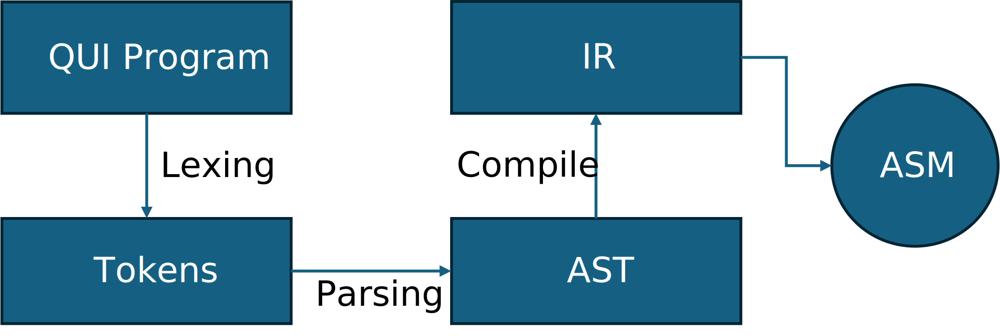

# QiuLang
A Turing-complete language implemented entirely in pure C, with no external libraries, built from scratch.



## Run
**Compile lexer:**
```shell
gcc common.c lexer.c parser.c ir.c compiler.c -Iinclude -o qui -O3 -Wall
```

for debugging:
```shell
gcc -DDEBUG common.c lexer.c parser.c ir.c compiler.c -Iinclude -o qui -g -Wall
```